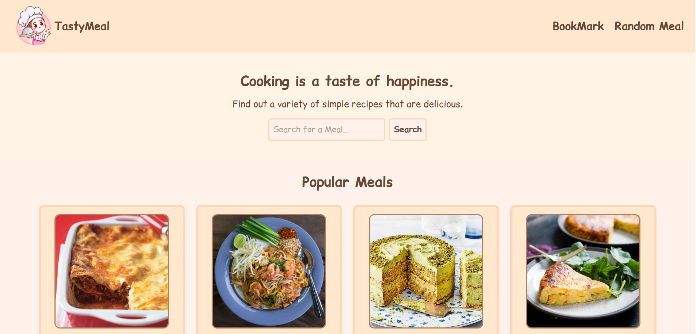

# 🍽️ Tasty Meal (Recipe Finder Web App)



This project is a **Frontend Application** for browsing and discovering cooking recipes.  
Users can **search for recipes** and **bookmark** their favorite recipes for later access.

## ✨ Features

- 🔍 Search for recipes
- 📌 Bookmark favorite recipes
- 📱 Responsive interface for all device sizes
- 🍳 View detailed information including ingredients and instructions

## 🛠️ Tech Stack

- **React + Vite**
- **TypeScript**
- **Tailwind CSS**
- **API Integration** for fetching recipe data

## 🚀 Getting Started

Clone this repository and install dependencies:

```bash
git clone git@github.com:Lhinglhingrchy/Tasty-Meal.git
cd .\Tasty-Meal\
npm install
npm run dev
```

## ▲ Deploy on Vercel

Live Demo: https://tasty-meal.vercel.app/
